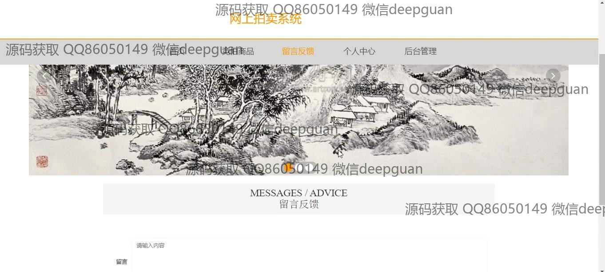
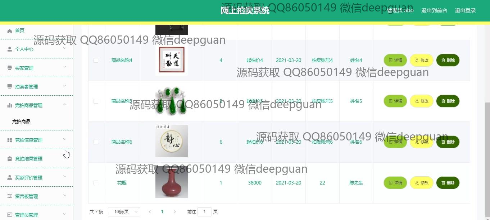
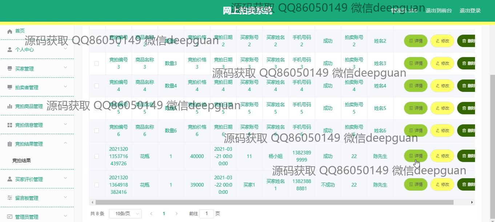

<h1 align="center">基于SSM框架的网上拍卖系统的设计与实现+vue</h1>

## 简介
网上拍卖系统：角色分为管理员、买家、卖家；支持商品管理、竞拍管理、个人中心、留言反馈、买家评价管理、后台统计分析等功能。    --计算机毕业设计源码；毕设源码；java毕业设计源码

## 联系方式

<h3 align="center">获取完整代码与数据库文件 + 微信：deepguan QQ: 86050149 QQ群: 783742310</h3>

<h3 align="center">可帮忙远程部署 包运行成功！提供远程部署、修改代码、设计文档指导、代码讲解等服务！</h3>

## 功能介绍（完整见运行截图）
管理员： 管理员可通过系统界面进行用户及拍卖者的管理，提供用户信息查询、添加、删除和修改等操作功能。管理员界面支持导航模块切换，包括买家管理、拍卖者管理和其他管理模块，方便进行全面的用户信息管理和系统控制。管理员可查看交易记录并进行审核，确保拍卖活动的合规性和有效性。身份识别和退出功能使管理员能安全、有效地操作系统，并支持用户角色的权限配置与系统管理。

买家： 买家可以通过网上拍卖系统进行注册和登录，访问导航栏中的各个功能模块，包括个人中心、竞拍商品、留言反馈和查看拍卖信息等。个人中心允许买家查看及修改个人信息，并更换头像和设置联系信息。买家可浏览商品列表，查看详细的拍品信息，包括名称、起拍价、发布日期等，并参与商品的竞拍。系统提供便捷的商品搜索和竞拍结果查看功能，确保买家顺利参与拍卖活动。

拍卖者： 拍卖者通过系统可进行商品的发布和拍卖管理，界面包括商品信息录入表单，支持上传图片、设定拍卖价格及数量等，拍卖者能够编辑富文本描述详细商品信息。在个人中心，拍卖者可以查看和更新个人信息，包括账号、联系方式等。导航菜单中提供拍卖商品管理、拍卖信息管理和卖拍结果管理等功能模块，帮助拍卖者高效管理其竞拍商品和结果信息，支持卖拍数据的查询与操作。

系统用户： 系统用户包括所有访问系统的注册成员，他们可通过注册和登录进行网站访问，随时切换用户角色，如买家或拍卖者。系统提供简洁的用户信息管理界面，支持修改个人详情。用户可在主页浏览推荐商品及参与竞拍，查看个人中心管理订单和地址等信息，实现个性化的用户体验。导航栏中的功能模块使用户能快速访问系统中的不同应用领域，如竞拍商品、个人中心、留言管理和拍卖信息查看等功能。

## 运行截图

本代码来源于网络,仅供学习参考使用!

